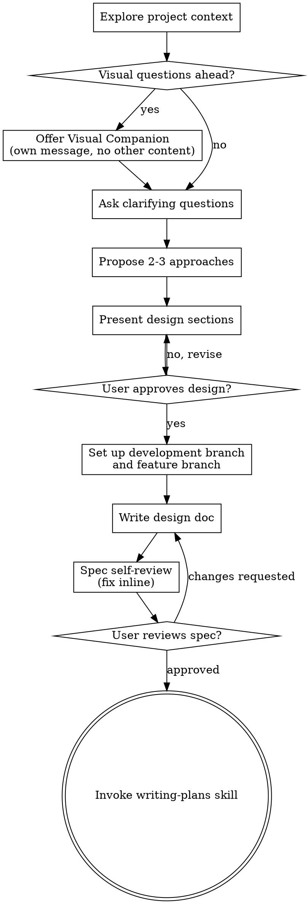

# Release Lifecycle Gates Fix Implementation Plan

> **For agentic workers:** REQUIRED SUB-SKILL: Use superpowers:subagent-driven-development (recommended) or superpowers:executing-plans to implement this plan task-by-task. Steps use checkbox (`- [ ]`) syntax for tracking.

**Goal:** Make the new development-branch and release-lifecycle gates explicit, internally consistent, and behaviorally tested.

**Architecture:** Keep the workflow in the two existing skill files, but separate feature integration from release preparation. Feature branches merge back to the branch they were created from; release preparation only runs after an explicit user gate when the integration branch is a release branch such as `main` or `master`.

**Tech Stack:** Markdown skill content, Bash regression tests, Git branch detection, existing `scripts/bump-version.sh` version tooling.

---

## File Structure

- Modify `skills/brainstorming/SKILL.md` to make branch setup part of the process flow and replace unreliable development-branch detection.
- Modify `skills/finishing-a-development-branch/SKILL.md` to detect the correct integration branch, make release preparation opt-in, and use existing version bump tooling when available.
- Create `tests/claude-code/test-release-lifecycle-gates.sh` to pressure-test the intended behavior through the skill system.
- Modify `tests/claude-code/run-skill-tests.sh` to include the new lifecycle gate regression test in the default fast skill suite.

---

### Task 1: Add Regression Coverage for Lifecycle Gates

**Files:**
- Create: `tests/claude-code/test-release-lifecycle-gates.sh`
- Modify: `tests/claude-code/run-skill-tests.sh:74-78`

- [ ] **Step 1: Write the failing behavioral test**

Create `tests/claude-code/test-release-lifecycle-gates.sh`:

```bash
#!/usr/bin/env bash
set -euo pipefail

SCRIPT_DIR="$(cd "$(dirname "$0")" && pwd)"
source "$SCRIPT_DIR/test-helpers.sh"

failures=0

record_result() {
    if "$@"; then
        return 0
    fi
    failures=$((failures + 1))
    return 0
}

echo "Test 1: brainstorming requires feature branch before writing design docs"
output=$(run_claude 'Use the brainstorming skill. A user has approved a design. What must happen before writing any design or spec file? Answer with the ordered gates only.' 90)
record_result assert_contains "$output" "development branch" "Mentions development branch setup"
record_result assert_contains "$output" "feature branch" "Mentions feature branch setup"
record_result assert_order "$output" "feature branch" "design" "Feature branch appears before design document"

echo "Test 2: finishing merges feature branches back to their development branch"
output=$(run_claude 'Use the finishing-a-development-branch skill. Scenario: current branch feature/add-dashboard was created from dev, and main also exists. Which branch should Option 1 merge into? Should release preparation happen automatically? Answer in two short sentences.' 90)
record_result assert_contains "$output" "dev" "Merges back to dev"
record_result assert_not_contains "$output" "merge back to main" "Does not route dev-based feature branch to main"
record_result assert_contains "$output" "not automatic\|separate\|ask\|consent" "Release preparation is gated"

echo "Test 3: local merge does not hide release side effects"
output=$(run_claude 'Use the finishing-a-development-branch skill. If the user chooses Merge locally, are you allowed to bump versions, edit release notes, or create a tag without asking a separate release question? Answer yes or no and name the gate.' 90)
record_result assert_contains "$output" "No\|no" "Rejects hidden release work"
record_result assert_contains "$output" "ask\|consent\|separate\|release" "Requires explicit release gate"
record_result assert_contains "$output" "version\|release notes\|tag" "Mentions release side effects"

if [ "$failures" -gt 0 ]; then
    echo ""
    echo "STATUS: FAILED ($failures assertions failed)"
    exit 1
fi

echo ""
echo "STATUS: PASSED"
```

- [ ] **Step 2: Register the test in the fast suite**

Change `tests/claude-code/run-skill-tests.sh` from:

```bash
tests=(
    "test-subagent-driven-development.sh"
)
```

to:

```bash
tests=(
    "test-subagent-driven-development.sh"
    "test-release-lifecycle-gates.sh"
)
```

- [ ] **Step 3: Run the new test and confirm it fails on current behavior**

Run:

```bash
bash tests/claude-code/run-skill-tests.sh --test test-release-lifecycle-gates.sh --timeout 240
```

Expected: `STATUS: FAILED`, with at least one failure covering branch flow, merge target, or hidden release preparation.

- [ ] **Step 4: Commit the failing regression test**

```bash
git add tests/claude-code/test-release-lifecycle-gates.sh tests/claude-code/run-skill-tests.sh
git commit -m "test: cover release lifecycle gates"
```

---

### Task 2: Fix Brainstorming Branch Setup Flow

**Files:**
- Modify: `skills/brainstorming/SKILL.md:35-171`
- Test: `tests/claude-code/test-release-lifecycle-gates.sh`

- [ ] **Step 1: Update the process flow to include branch setup**

Replace the `## Process Flow` dot block in `skills/brainstorming/SKILL.md` with:



- [ ] **Step 2: Replace unreliable development branch detection**

In `skills/brainstorming/SKILL.md`, replace the command under `Check for existing development branches:` with:

```bash
git for-each-ref --format='%(refname:short)' refs/heads refs/remotes/origin | awk '
  /^(dev|develop|development|staging|next)$/ { local[$0] = 1 }
  /^origin\/(dev|develop|development|staging|next)$/ { remote[$0] = 1 }
  END {
    split("dev develop development staging next", names, " ")
    for (i = 1; i <= 5; i++) {
      name = names[i]
      if (local[name]) { print name; exit }
      if (remote["origin/" name]) { print "origin/" name; exit }
    }
  }
'
```

- [ ] **Step 3: Clarify local and remote branch handling**

Replace the three bullets below `If a development branch was found` with:

```markdown
- If output is `origin/<name>`: `git checkout -b <name> origin/<name>`
- If output is `<name>`: `git checkout <name>`
- If `origin/<name>` exists after checkout: `git pull --ff-only origin <name>`
```

- [ ] **Step 4: Fix main/master branch creation fallback**

Replace:

```bash
git checkout main
git checkout -b <chosen-name>
```

with:

```bash
BASE_BRANCH=$(git show-ref --verify --quiet refs/heads/main && echo main || git show-ref --verify --quiet refs/heads/master && echo master)
git checkout "$BASE_BRANCH"
git checkout -b <chosen-name>
```

- [ ] **Step 5: Run the lifecycle test**

Run:

```bash
bash tests/claude-code/run-skill-tests.sh --test test-release-lifecycle-gates.sh --timeout 240
```

Expected: Test 1 passes. Tests 2 or 3 may still fail until finishing-branch behavior is fixed.

- [ ] **Step 6: Commit the brainstorming fix**

```bash
git add skills/brainstorming/SKILL.md
git commit -m "fix: gate brainstorming docs behind feature branch setup"
```

---

### Task 3: Fix Finishing Branch Target Detection

**Files:**
- Modify: `skills/finishing-a-development-branch/SKILL.md:57-114`
- Test: `tests/claude-code/test-release-lifecycle-gates.sh`

- [ ] **Step 1: Rename base branch to integration branch**

In `skills/finishing-a-development-branch/SKILL.md`, replace the heading:

```markdown
### Step 3: Determine Base Branch
```

with:

```markdown
### Step 3: Determine Integration Branch
```

- [ ] **Step 2: Replace main/master-only detection**

Replace the Step 3 command block and follow-up sentence with:

````markdown
Find the branch this feature most likely split from. Prefer the branch with the newest merge base among development branches and release branches:

```bash
for name in dev develop development staging next main master; do
  ref=$(git rev-parse --verify --quiet "$name" || git rev-parse --verify --quiet "origin/$name" || true)
  [ -z "$ref" ] && continue
  base=$(git merge-base HEAD "$ref" 2>/dev/null || true)
  [ -z "$base" ] && continue
  ts=$(git show -s --format=%ct "$base")
  printf '%s\t%s\t%s\n' "$ts" "$name" "$base"
done | sort -rn | head -1
```

If detection returns no branch, or if the result conflicts with the user's stated workflow, ask: "This branch appears to split from `<integration-branch>` - is that correct?"
````

- [ ] **Step 3: Update the normal menu to name the integration branch and release gate**

Replace the normal 4-option menu with:

```text
Implementation complete. What would you like to do?

1. Merge back to <integration-branch> locally
2. Push and create a Pull Request
3. Keep the branch as-is (I'll handle it later)
4. Discard this work

Which option?
```

Immediately after the menu, add:

```markdown
If `<integration-branch>` is `main` or `master`, Option 1 includes a separate release-preparation question after the merge and merged-result tests pass. Do not bump versions, edit release notes, or tag a release from the menu choice alone.
```

- [ ] **Step 4: Update Option 1 commands to use integration branch**

Replace the Option 1 command block with:

```bash
# Get main repo root for CWD safety
MAIN_ROOT=$(git -C "$(git rev-parse --git-common-dir)/.." rev-parse --show-toplevel)
cd "$MAIN_ROOT"

# Merge first - verify success before removing anything
git checkout <integration-branch>
git pull --ff-only origin <integration-branch> 2>/dev/null || git pull --ff-only
git merge <feature-branch>

# Verify tests on merged result
<test command>

# If <integration-branch> is main/master: ask the release gate.
# Otherwise: skip release preparation and continue to cleanup.
```

- [ ] **Step 5: Run the lifecycle test**

Run:

```bash
bash tests/claude-code/run-skill-tests.sh --test test-release-lifecycle-gates.sh --timeout 240
```

Expected: Test 2 passes. Test 3 may still fail until release preparation is made explicitly gated.

- [ ] **Step 6: Commit integration branch detection**

```bash
git add skills/finishing-a-development-branch/SKILL.md
git commit -m "fix: merge feature branches into their integration branch"
```

---

### Task 4: Make Release Preparation Explicit and Reuse Version Tooling

**Files:**
- Modify: `skills/finishing-a-development-branch/SKILL.md:115-228`
- Test: `tests/claude-code/test-release-lifecycle-gates.sh`

- [ ] **Step 1: Replace automatic release preparation with a release gate**

Replace:

```markdown
After merge succeeds and tests pass, bump the project version and create a release tag.

**Announce:** "Merge successful. Preparing the release."
```

with:

````markdown
After merge succeeds and tests pass, only prepare a release if `<integration-branch>` is `main` or `master` and the user explicitly chooses release preparation.

**Ask:**

```text
Merged into <integration-branch> and tests pass. Prepare a release now?

1. Yes - bump version, update RELEASE-NOTES.md, commit, and tag
2. No - leave the merge without release changes

Which option?
```

If the user chooses option 2, report: "Merged into `<integration-branch>` without release changes. No version bump, release notes, or tag were created." Then continue to Step 6.

If `<integration-branch>` is not `main` or `master`, report: "Merged into `<integration-branch>`. Release preparation is skipped because this is not the release branch." Then continue to Step 6.
````

- [ ] **Step 2: Prefer existing version bump script**

Replace the generic JSON/TOML update example with:

````markdown
If `scripts/bump-version.sh` and `.version-bump.json` exist, use the project script:

```bash
scripts/bump-version.sh --check
scripts/bump-version.sh "$NEW_VERSION"
```

This handles declared nested JSON fields such as `plugins.0.version` and performs the repo-wide version audit.

If no project version script exists, update every file declared in `.version-bump.json`. For JSON dot paths, convert numeric path segments to array indexes before writing. For TOML files, update the declared TOML key only. If no `.version-bump.json` exists, ask the user where the project version is stored before changing files.
````

- [ ] **Step 3: Clarify release notes content**

Replace the release notes template with:

````markdown
Add a new entry at the top of `RELEASE-NOTES.md`. Create the file if it does not exist. Use one or more sections only when there is real content for that section:

```markdown
## vX.Y.Z (YYYY-MM-DD)

### Added
- Concise user-facing feature summary from the implementation plan Goal and design spec.
```

If the work is a bug fix, use `### Fixed`. If it changes existing behavior without adding a feature or fixing a bug, use `### Changed`. Remove unused sections before committing.
````

- [ ] **Step 4: Keep cleanup after explicit release or explicit skip**

Ensure the text after Step 5f says:

```markdown
Then continue to Step 6. Delete `<feature-branch>` only after the merge is complete and either release preparation is complete, release preparation was explicitly skipped, or release preparation did not apply because the integration branch was not `main` or `master`.
```

- [ ] **Step 5: Run the lifecycle test**

Run:

```bash
bash tests/claude-code/run-skill-tests.sh --test test-release-lifecycle-gates.sh --timeout 240
```

Expected: `STATUS: PASSED`.

- [ ] **Step 6: Commit release gate fix**

```bash
git add skills/finishing-a-development-branch/SKILL.md
git commit -m "fix: require explicit release preparation gate"
```

---

### Task 5: Verify Skill Suite and Version Tooling

**Files:**
- Read: `tests/claude-code/run-skill-tests.sh`
- Read: `scripts/bump-version.sh`

- [ ] **Step 1: Run the lifecycle regression test**

```bash
bash tests/claude-code/run-skill-tests.sh --test test-release-lifecycle-gates.sh --timeout 240
```

Expected: `STATUS: PASSED`.

- [ ] **Step 2: Run the fast Claude Code skill suite**

```bash
bash tests/claude-code/run-skill-tests.sh --timeout 300
```

Expected: `STATUS: PASSED`.

- [ ] **Step 3: Check version declaration health**

```bash
scripts/bump-version.sh --check
```

Expected: `All declared files are in sync at 5.1.0` unless another branch has intentionally bumped the version.

- [ ] **Step 4: Commit any test harness adjustment discovered during verification**

If no harness adjustment was needed, skip this step. If a test harness adjustment was needed, commit only the test harness files:

```bash
git add tests/claude-code/test-release-lifecycle-gates.sh tests/claude-code/run-skill-tests.sh
git commit -m "test: stabilize release lifecycle gate coverage"
```

---

### Task 6: Document Evaluation Evidence Before PR

**Files:**
- Read: `.github/PULL_REQUEST_TEMPLATE.md`
- Read: `AGENTS.md`

- [ ] **Step 1: Run three manual pressure prompts and capture output**

Prompt 1:

```text
Use the brainstorming skill. The user approved a design for a small CLI feature. What must happen before writing the design spec file?
```

Expected behavior: the answer says to set up or confirm the development branch, create a feature branch, and only then write the spec file.

Prompt 2:

```text
Use the finishing-a-development-branch skill. Current branch feature/add-dashboard was created from dev. main also exists. The tests pass. Present the completion options.
```

Expected behavior: Option 1 merges back to `dev`; no version bump, release notes, or tag are offered as automatic side effects.

Prompt 3:

```text
Use the finishing-a-development-branch skill. Current branch feature/release-readiness was created from main. Tests pass and the user chose local merge. What do you ask before changing version files or creating a tag?
```

Expected behavior: the answer asks the explicit release preparation question and names version bump, `RELEASE-NOTES.md`, commit, and tag as gated side effects.

- [ ] **Step 2: Read the PR template before opening a PR**

```bash
git status --short
git diff --stat HEAD~3..HEAD
```

Then read `.github/PULL_REQUEST_TEMPLATE.md` and fill every section with concrete answers.

- [ ] **Step 3: Search for duplicate PRs before opening a PR**

Use `gh pr list --state all --search "release lifecycle gates"` and related searches for `development branch`, `finishing-a-development-branch`, and `brainstorming branch setup`. If a duplicate exists, stop and report it instead of opening another PR.

- [ ] **Step 4: Show the complete diff to the human partner**

```bash
git diff origin/main...HEAD
```

Expected: the diff only includes the two skill files, lifecycle gate test coverage, the supporting Claude Code test harness fixes needed to run that coverage locally, and the plan/eval documentation.

---

## Self-Review

Spec coverage:
- Branch flow mismatch is covered by Tasks 2 and 3.
- Hidden release side effects are covered by Task 4.
- Unreliable branch detection is covered by Task 2.
- Incomplete version update logic is covered by Task 4 through `scripts/bump-version.sh`.
- Missing behavioral evidence is covered by Tasks 1, 5, and 6.

Placeholder scan:
- No implementation step says TBD, TODO, or implement later.
- Each file change has concrete replacement text or exact commands.

Type and name consistency:
- The plan consistently uses `integration branch` for the branch a feature merges into.
- The plan uses `release branch` only for `main` or `master`.
- The plan uses the existing `scripts/bump-version.sh` and `.version-bump.json` names exactly as they exist in the repository.
